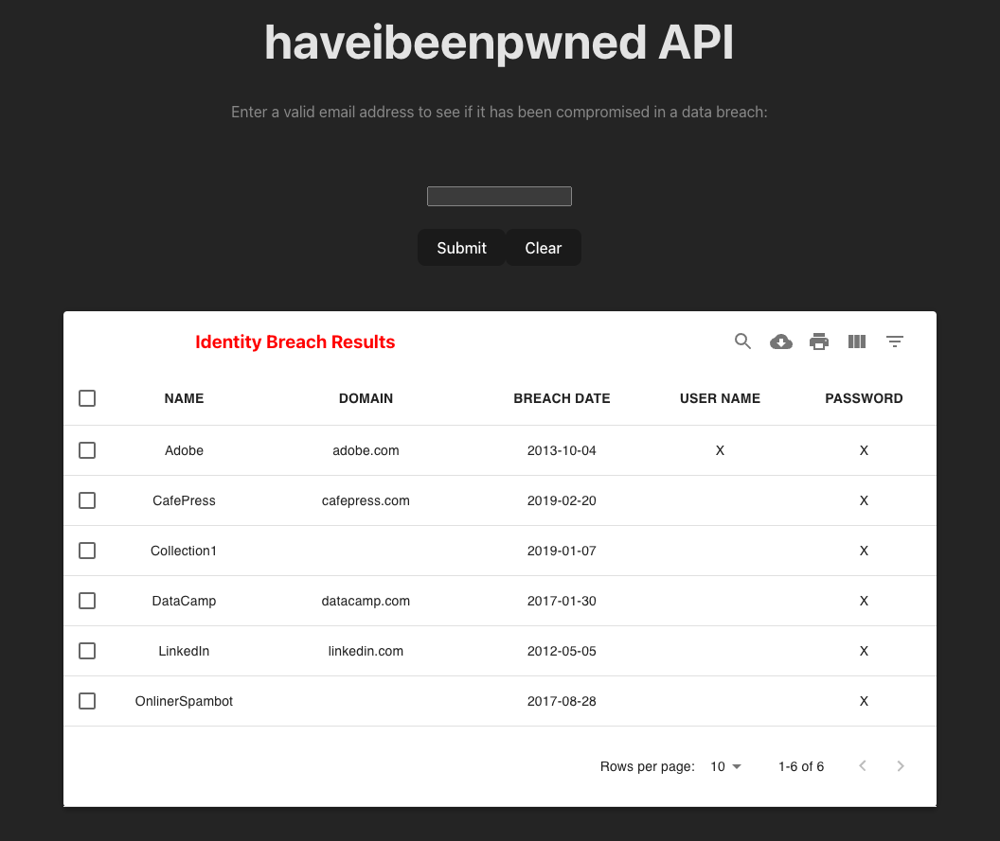

# haveibeenpwned API

## Setup Instructions

### Cloning Repo:

Pull down shared ‘haveibeenpwned-API’ repo into your local directory. Use Github’s fork function, then clone the repo by entering the below command into your CLI. Navigate to that directory

```bash
git clone [https-url] [new-folder-name]
cd [new-folder-name]
```

NOTE:

```bash
https-url = https://github.com/brett-webster/haveibeenpwned-API.git
```

### Installing Node Packages:

Batch install required libraries/dependencies (see package.json)

```bash
npm install
```

### Dev mode:

Enter the below command in the CLI to run the app in development mode (http://localhost:8080/)

```bash
npm run dev
```

Enter the below command in the CLI to run linter (debugging)

```bash
npm run lint
```

### Production mode:

Enter the below command in the CLI to build & bundle the app using Vite (results sent to ./dist folder)

```bash
npm run build
```

Once built, enter the below command in the CLI to run the app in production mode (http://localhost:3000/)

```bash
npm run preview
```

### Testing mode:

Enter the below command in the CLI to run a suite of unit tests (Jest)

```bash
npm test
```

Enter the below commands in the CLI to run testing coverage analysis

```bash
npm run coverage
```

<br> </br>

## The App

<p align="center">
  
</p>

### User Story

As a user, I want to be able to see if my username & password has been compromised in any security breaches. If it has been compromised, I should be able to see the details regarding where/when it was compromised.

### Summary

This fullstack app utilizes a simple Node/Express server & React front-end allowing a user to submit a valid email via a form field, fetch data from an external API & display a sortable & searchable table of all email-specific data breaches where a user name and/or password were known to be compromised.

The server exposes an endpoint (/api/breaches) in order to accept user requests via a validated email address query parameter. Upon extracting the email, it is once again passed along as a query parameter when pinging haveibeenpwned's public API for retrieving all known breaches that the email has been involved in. This list is filtered for only those breaches involving user names or passwords & returned to the client to display in an interactive, dynamic table. Table columns include: Name, Domain, Breach Date, User Name, Password.

### Potential Future Improvements

- Replace transmission of email address using query parameter via GET requests by a more secure method (such as body via a POST request)
- Consider ways to improve load time (e.g. cache previously returned results, slim down payload returned from server to only data required by client, optimize use of external API)
- Investigate additional ways to reduce bundle build size (rollup 'visualizer' & 'build' plug-ins added to vite.config.ts)
- Further explore rate limiting on both this app & on the official haveibeenpwned API side
- Add more granular error handling on the back-end
- Add integration testing
- Design:
  - No visual indicator of MUI DataTable column sort availability other than on hover; consider adding
  - Column header sorting arrows remain intact after subsequently sorting a different column (potentially confusing)
  - Default sort on load is ascending by 'Name'; defaulting instead to descending by 'Breach Data' may be more valuable to user
  - Consider adding modal confirmation upon deleting a breach (or multiple breaches), an 'undo latest event' capability & a way to fully restore all deleted breaches to initial load
  - Expanding the table's rows per page to 15 or 100 sets the focus at far bottom of table/page; consider applying an auto-scroll back to top
  - Work with a professional designer :)

### Tech Stack

- Vite
- React.js
- TypeScript
- Node.js
- Express.js
- Postman
- Axios
- Material UI
- Jest
